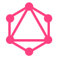

# Candi Golang Framework

> Golang project generator framework

  
  
  
  
  
  

<h3 style="color:white">Generate monorepo / microservice project within seconds</h3>
<h3 style="color:white">Using simple Candi-CLI command and make file command</h3>

[Get Started](#main)
[GitHub](https://github.com/golangid/candi)